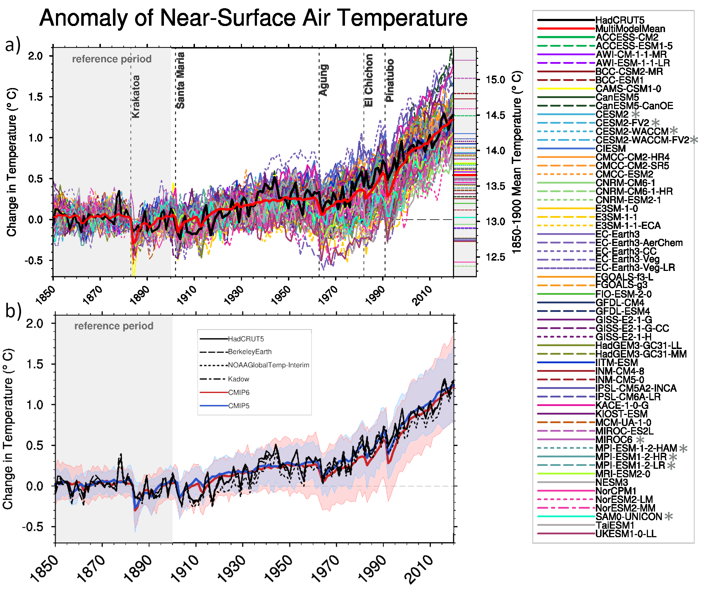

Chapter X: chapter title
====================================


## Contents

- [Introduction](#introduction)
- [Name your repository](#naming)
- [Repository structure](#respository-structure)
- [Key concepts](#key-concepts)
- [The `CITATION.cff` file](#citation)
- [Controlled vocabulary](#controlled-vocabulary)
- [Figures](#figures)

# Introduction

This is a template respository for the management and submission of IPCC AR7 figures. This repository is meant to store report figures at the chapter level, along with the data, code, and environment information necessary to reproduce the figures. We acknowledge that publishing clean code and data is time-consuming, and that many figures don't survive the rounds of reviews, so we're only expecting code and data to be prepared for the Final Government Distribution (FGD), not the First Order Draft (FOD) or Second Order Draft (SOD). At the same time, delaying the data and code preparation process at the last minute will be painful for everyone involved because it will pile on the final publication rush. What we're proposing is a gradual approach to data and code curation, where each draft adds a bit more content to the repository for the sake of building experience and resolving issues in a stress-free environment.

# Name your repository

Please name your repository according to the following convention:  ``ar7-<report>-<draft>-<chapter>``, referring to the Controlled Vocabulary table for the abbreviations. 

# Repository structure
The repository structure is described below. Please create one repository for each chapter and for each draft.
- `figX`: The `figX/` folder is the main location for storing figure information. It contains three subfolders: data/, code/, and figure/, which are described below. You should duplicate the folder (including subfolders) for each figure in the chapter and name it accordingly (e.g., fig1, fig2, box1fig1).  
- `data`: The `data/` subfolder is where you should store data to create the figure. It is meant to be self-contained, and include all information displayed in the figure. The data included here should require no substantial transformation to be used in the figure. This means for example that data units should match figure units.
– `code`: The `code/` subfolder is where you should store the code used to analyse input data and create the data for the figure, if any. If no such code is necessary, simply remove this directory.
- `figure`: The `figure/` subfolder is where you should upload the figure image file and complete 
- `env`: The `env/` folder contains environment specification files and documentation necessary to recreate the software environment used in this project. This ensures that analyses and figures can be reproduced reliably across different systems.
- `resources`: The `resources/` folder may be used to store and track datasets, workflows, metadata, or other notes that apply to one or more figures in the chapter. Consider it an add-on space. It should not be used in replacement of the folders described above.

# Key concepts
- By `data`, we mean here the data displayed in the figure, not the source datasets they derive from. Please do not commit large input datasets in this repository;
- By `metadata`, we mean the information about the figure, such as its title, caption, authors, and references. This information is captured in a CITATION.cff file, documented here.

# The `CITATION.cff` file

The file ``CITATION.cff`` holds basic information about the figure, data, or code. It minimally requires a `title`, `authors`, `message` and the `cff-version`. Additional fields are requried depending on the draft order:

- FOD: `abstract` with the figure caption;
- SOD: `references` with the list of references (data and/or publication) used to create the figure;
- FGD: a `doi` for each reference listed in the `references` field.  

## Example of a `CITATION.cff` file

```yaml
title: Title of figure, e.g. Figure 4.11 | Multiple lines of evidence for global surface air temperature (GSAT) changes for the long-term period, 2081–2100, relative to the average over 1995–2014, for all five priority scenarios.
abstract: Standalone description of methods necessary to understand the figure.
authors:
  - family-names: Asselin
    given-names: Alice
    orcid: "https://orcid.org/0000-0000-0000-0001"
  - family-names: Brun
    given-names: Bob
    orcid: "https://orcid.org/0000-0000-0000-0001"
references:
  - title: Data for Figure 4.11 of AR7 SRC Chapter 4
    authors:
      - name: A. Asselin et al.
    type: data
    data-type: CSV
    doi: 10.5281/zenodo.3678927
cff-version: 1.2.0
```

# Controlled vocabulary

Whenever a template includes fields for `<report>, <draft>, <chapter>` or `<figure>`, please use abbreviations from the table below.

| Type        | Full name                                 | Abbreviation |
|-------------|-------------------------------------------|-------------|
| ``report``  |                                           |             |  
|             | Special Report on Cities                  | src         |
|             | Working Group I                           | wg1         |
|             | Working Group II                          | wg2         |
|             | Working Group III                         | wg3         |
|             | Synthesis Report                          | syr         |
| ``draft``   |                                           |             |
|             | Zero Order Draft                          | zod         | 
|             | First Order Draft                         | fod         |
|             | Second Order Draft                        | sod         |
|             | Final Government Distribution             | fgd         |
| ``chapter`` |                                           |             |
|             | Summary for Policymakers                  | spm         |
|             | Technical Summary                         | ts          |
|             | Chapter 1                                 | ch1         |
|             | Cross-Chapter Paper 1                     | ccp1        |
|             | Annex III                                 | ann3        |
|             | Atlas                                     | atlas       |
| ``figure``  |                                           |             |
|             | Figure 4.1                                | fig1        |
|             | Cross-Chapter Box 4.1, Figure 1           | ccb1fig1  |
|             | Cross-Section Box TS.1, Figure 1          | csb1fig1  |
|             | Box 4.1, Figure 1                         | box1fig1  |
|             | Frequently Asked Questions 4.1, Figure 1  | faq1fig1  |

# Figures

For ease of reference and review by the TSU, please link to all figures in this chapter, as indicated below.

Example:

| Figure Folder | Preview | Figure Title |
|---------------|---------|-------------|
| [fig99_01](./figures/fig99_01/) |  | Title of fig99_01 |
|  |  |  |
|  |  |  |
|  |  |  |

